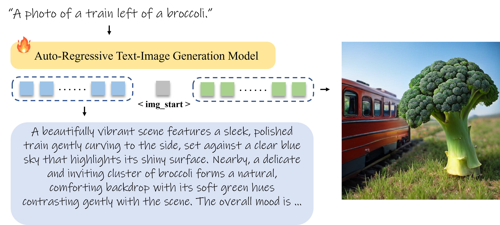

<!-- markdownlint-disable first-line-h1 -->
<!-- markdownlint-disable html -->
<!-- markdownlint-disable no-duplicate-header -->


<div align="center">
<h1>🚀 ReasonGen-R1: Cot for Autoregressive Image generation models through SFT and RL</h1>

</div>

<div align="center">

  <a href="https://www.deepseek.com/" target="_blank">
    
  </a>
  </a>
  <a href="https://huggingface.co/collections/Franklin0/reasongen-r1-6836ed61fc4f6db543c0d368" target="_blank">
    
  </a>

</div>


<p align="center">
  <a href="#2-model-download"><b>📥 Model Download</b></a> |
  <a href="#3-quick-start"><b>⚡ Quick Start</b></a> |
  <a href="#4-license"><b>📜 License</b></a> |
  <a href="#5-citation"><b>📖 Citation</b></a> <br>
  📄 <a href="xxxxxx"><b>Paper Link</b></a>
  <!-- 🤗 Online Demo (<a href="https://huggingface.co/spaces/deepseek-ai/Janus-Pro-7B"><b>Janus-Pro-7B</b></a>, <a href="https://huggingface.co/spaces/deepseek-ai/Janus-1.3B"><b>Janus</b></a>, <a href="https://huggingface.co/spaces/deepseek-ai/JanusFlow-1.3B"><b>JanusFlow</b></a>) -->
</p>

## 1. Introduction

Although chain-of-thought (CoT) reasoning and reinforcement learning (RL) have driven breakthroughs in NLP, their integration into generative vision models remains underexplored. We introduce ReasonGen-R1, a two-stage framework that first imbues an autoregressive image generator with explicit text-based “thinking” skills via supervised fine-tuning (SFT) on a newly generated reasoning dataset of written rationales, and then refines its outputs using Generation-Reward Proximal Optimization (GRPO).
Text-based CoT reasoning dataset for image synthesis. We automatically generate and release a corpus of step-by-step, model-crafted rationales paired with visual prompts, enabling controlled planning of object layouts, styles, and scene compositions.
RL refinement with GRPO. Our GRPO algorithm uses reward signals from a pretrained vision–language model to assess overall visual quality, optimizing the policy in each update.
Evaluations on Geneval, DPG, and the T2I benchmark demonstrate that ReasonGen-R1 consistently outperforms strong baselines and prior state-of-the-art models. We will open-source our generated reasoning dataset and training code to accelerate further advances in text-based reasoning–driven image generation.

<div align="center">

<br>

</div>
 

## 2. Model Download

We release ReasonGen-R1 to the public to support a broader and more diverse range of research within both academic and commercial communities.
Please note that the use of this model is subject to the terms outlined in [License section](#5-license). Commercial usage is
permitted under these terms.

### Huggingface

| Model                 | Download                                                                    |
|-----------------------|-----------------------------------------------------------------------------|
| ReasonGen-R1 | [🤗 Hugging Face](https://huggingface.co/Franklin0/ReasonGen-R1) |
| ReasonGen-R1-SFT-Only | [🤗 Hugging Face](https://huggingface.co/Franklin0/ReasonGen-R1-SFT) |


## 3. Quick Start

### Installation

You can install the necessary dependencies by running the following command:

```shell
conda create -n image_rl python==3.12 -y
conda activate image_rl
pip3 install torch==2.6.0 torchvision --index-url https://download.pytorch.org/whl/cu124
pip3 install flash-attn --no-build-isolation
git clone https://github.com/Franklin-Zhang0/Image-RL.git
cd Image-RL
pip install -r requirements.txt
pip install -e .
pip install -e ./Janus
```

### Inference
To inference with the ReasonGen-R1 model, you can use the following command:
```shell
python Image-RL/Janus/cot_generate_inference.py
```

### SFT Training
To train the SFT model from Janus-Pro-7B model on the ReasonGen-R1-SFT-200k dataset, you can use the following command:
```shell
bash Image-RL/examples/janus_sft.sh
```

### RL Training
To train the RL model from the ReasonGen-R1-SFT model, you can use the following command:
```shell
bash Image-RL/Janus/janus_rl.py
```


## 5. Acknowledgements
We would like to thank <a href="https://github.com/volcengine/verl">Verl</a>, upon which our repo is built.

## 4. Citation

```bibtex
@article{yu2025reasongen,
  title={ReasonGen-R1: Cot for Autoregressive Image generation models through SFT and RL},
  author={Yu Zhang, Yunqi Li, Yifan Yang, Rui Wang， Yuqin Yang, Qi Dai, Jianming Bao, Dongdong Chen, Chong Luo, Lili Qiu},
  journal={xxxxxx},
  year={2025}
}
```
